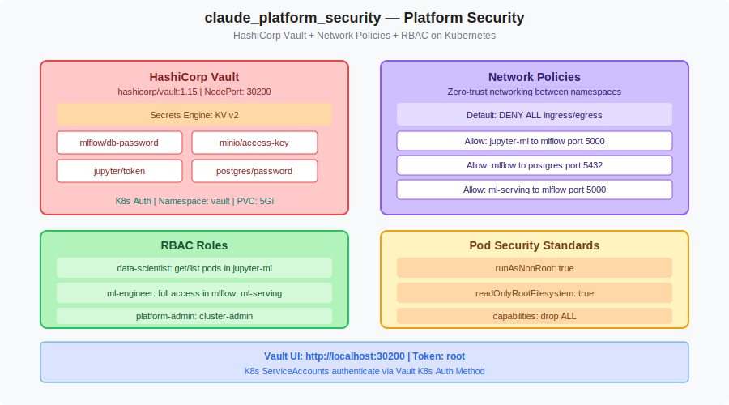

# claude_platform_security: Platform Security on Kubernetes

> P6 Platform Security — HashiCorp Vault + Network Policies + RBAC  
> Part of the kiranch97 Solutions Architecture

---

## Overview

Deployes **platform-wide security** for the Kubernetes ML platform:

- **HashiCorp Vault** — Centralized secrets management, NodePort 30200
- **Network Policies** — Default deny-all with explicit allow rules between namespaces
- **RBAC** — Role-based access (data-scientist, ml-engineer, platform-admin roles)
- **Pod Security Standards** — Non-root containers, read-only filesystems

---

## Architecture



---

## Directory Structure

```
claude_platform_security/
├── README.md
├── docs/
│   └── architecture.svg
└── k8s/
    ├── namespace.yaml           # vault namespace
    ├── vault.yaml               # HashiCorp Vault deployment + PVC + services
    ├── network-policies.yaml    # Default deny-all + explicit allow rules
    └── rbac.yaml                # Roles and RoleBindings per team
```

---

## Deploy

```bash
git clone https://github.com/kiranch97/claude_platform_security.git
cd claude_platform_security

# Deploy in order
kubectl apply -f k8s/namespace.yaml
kubectl apply -f k8s/vault.yaml
kubectl apply -f k8s/rbac.yaml
kubectl apply -f k8s/network-policies.yaml
```

Add to /etc/hosts: `127.0.0.1  vault.local`

---

## Access

| Service | URL | Token |
|---------|-----|-------|
| Vault UI | http://localhost:30200 | root |
| Vault Ingress | http://vault.local:30080 | root |

### Store platform secrets in Vault

```bash
export VAULT_ADDR=http://localhost:30200
export VAULT_TOKEN=root

# Enable KV v2 secrets engine
vault secrets enable -path=secret kv-v2

# Store all platform secrets
vault kv put secret/mlflow     db_password=mlflow    minio_key=minioadmin
vault kv put secret/jupyter    token=claude-ml-2026
vault kv put secret/postgres   password=postgres
vault kv put secret/minio      root_user=minioadmin  root_password=minioadmin
vault kv put secret/airflow    db_password=airflow   secret_key=airflow-secret
```

### Enable Kubernetes Auth (for in-cluster access)

```bash
vault auth enable kubernetes
vault write auth/kubernetes/config \
  kubernetes_host=https://kubernetes.default.svc
```

---

## Network Policy Summary

| Source Namespace | Destination | Port | Policy |
|-----------------|-------------|------|--------|
| `jupyter-ml` | `mlflow` | 5000 | Allow |
| `mlflow` | `mlflow` (postgres) | 5432 | Allow |
| `mlflow` | `mlflow` (minio) | 9000 | Allow |
| `ml-serving` | `mlflow` | 5000 | Allow |
| `airflow` | `mlflow` | 5000 | Allow |
| `airflow` | `data-platform` | 9000, 5432 | Allow |
| All | All | * | Deny |

---

## RBAC Roles

| Role | Namespace | Permissions |
|------|-----------|-------------|
| `data-scientist` | `jupyter-ml` | get/list pods, logs |
| `ml-engineer` | `mlflow`, `ml-serving` | full access |
| `pipeline-runner` | `airflow` | full access |
| `platform-admin` | cluster-wide | cluster-admin |

---

## Cleanup

```bash
kubectl delete namespace vault
kubectl delete networkpolicies --all -n mlflow
kubectl delete networkpolicies --all -n jupyter-ml
```

---

## Author
**kiranch97** — Built collaboratively with Claude AI | March 2026
